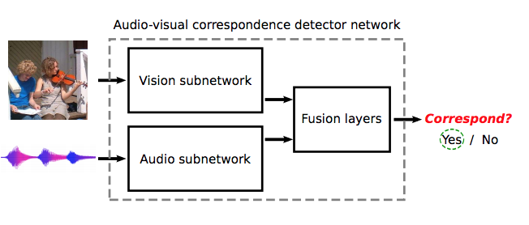

# LLLNet
## About
This is a Keras implementation of ["Look, Listen and Learn"](https://arxiv.org/pdf/1705.08168.pdf) Model on the research by R. Arandjelovic and A. Zisserman, at DeepMind. This model can get cross-modal features between audios and images.

## Core Concept

## Different Point from Original Model
- SqueezeNet is used for visual CNN.
